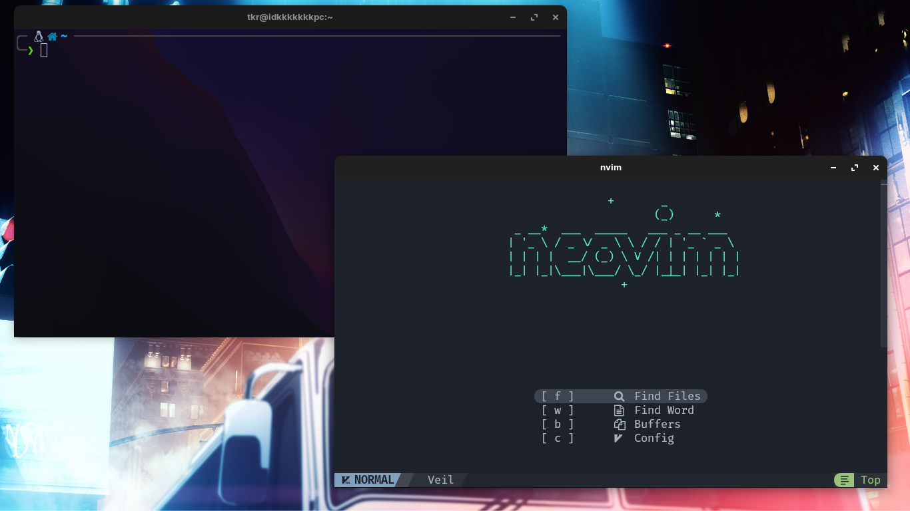
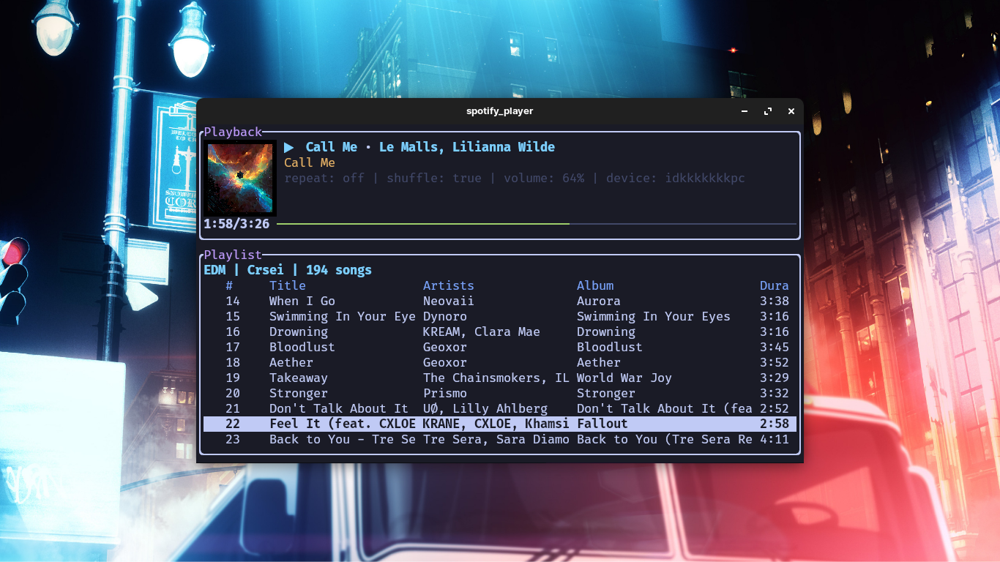

<div align="center">
  <h1>Dotfiles</h1>
</div>

<p align="center">
  
  
  
</p>

## Details

- **Terminal**: [kitty](https://github.com/kovidgoyal/kitty/)
- **Shell**: [zsh](https://www.zsh.org/)
- **Editor**: [neovim](https://github.com/neovim/neovim)
- **Application Launcher**: [rofi](https://github.com/davatorium/rofi)
- **Music Player**: [spotify-player](https://github.com/aome510/spotify-player)
- **Font**: [FiraCode NerdFont](https://www.nerdfonts.com/font-downloads)

## Setup

### Required Dependencies

- [FiraCode NerdFont](https://www.nerdfonts.com/font-downloads) for kitty and rofi.
- [Node.js](https://nodejs.org/es/download), [Yarn](https://classic.yarnpkg.com/lang/en/docs/install/) and [Rust](https://www.rust-lang.org/tools/install) for neovim.
- [oh my zsh](https://ohmyz.sh/) for zsh.

> Clone this repository

```sh
git clone https://github.com/shikr/dotfiles.git
cd dotfiles
```

> Run installation script

```sh
./install.sh
```

### Customize your installation

Usage: `./install.sh [OPTIONS...]`

```
Options:
  -p, --no-zsh-plugins      Don't install zsh plugins
  -S, --symlink             Create symlinks instead of copying files
  -d, --delete, --no-backup Don't create backup files
  -i, --ignore <OPTIONS>    Don't install specified files (-i zsh,rofi)
                            OPTIONS: kitty, neovim, rofi, spotify_player, zsh, starship
  -s, --silent              Don't show progress messages
  -h, --help                Show this help message
```

## Credits

- [Rofi Theme](https://github.com/adi1090x/rofi)
- [Rofi Background Image](https://www.pixiv.net/artworks/60839445)
